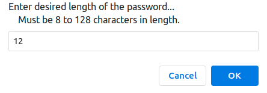
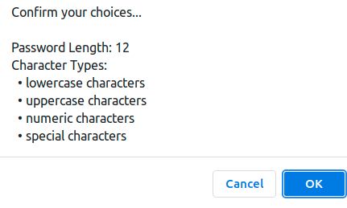
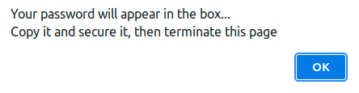

# Password Generator

## Website
https://msdale.github.io/password-generator/

## URL image

### Instructions
#### (1) Press Generate-Password Button
#### (2) Enter password length (enter a number and hit OK)

#### (3) Confirm password length (hit 'OK')

#### (4) Choose character types (any of 'l' 'u' 'n' 's' or 'a' alone (hit OK))

#### (5) Confirm all choices (hit OK)

#### (6) Respond to notification of password generation (hit OK)

#### (7) Copy and use your password (copy and paste...or memorize (HA!))

